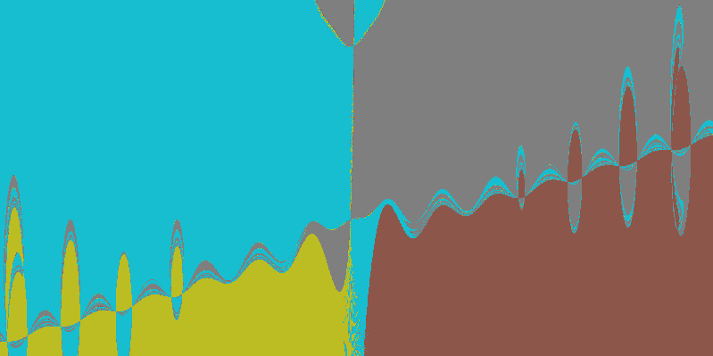

# Introduction
This program generates images and animations of [basins of attraction](https://en.wikipedia.org/wiki/Attractor)
for pairs of equations in 2 unknowns.

It does this by solving [Newton's method](https://en.wikipedia.org/wiki/Newton%27s_method) at every pixel, and colouring each pixel according to the solution to
which it converges. The unique solutions are found and assigned colours automatically, and are also used to
automatically determine the limits of the 2D region represented by the image/animation.

By default, there is acceleration using `numba` ahead-of-time compilation (for CPUs), and a bespoke quadtrees
implementation (if enough pixels in a zone all give the same result, the remaining pixels are automatically filled in that colour
without actually running Newton's method for those pixels). `taichi` GPU acceleration is a work-in-progress
and does not currently support the quadtrees acceleration.

# How to use
1. Create a Python [virtual environment](https://docs.python.org/3/library/venv.html#creating-virtual-environments) and install the requirements from `requirements.txt`.
2. Run the application from the `./basins` directory either...
   1. With uvicorn:
      - `uvicorn src.api.controller:app --host=0.0.0.0 --port=8000 --reload`
   2. With Docker ([Docker](https://docs.docker.com/desktop/) must be installed):
      - `docker build -t basins .`
      - `docker run -p 8000:8000 --mount type=bind,source="$(pwd)"/images,target=/basins/images --mount type=bind,source="$(pwd)"/build,target=/basins/build basins`
3. To create an...
   1. Image, HTTP POST to `http://localhost:8000/create/still` with example payload:
      ```
      {
       # Equations (zero on the other side) to solve
       "expressions":  ["y**2+2*x*y+2*x**2-4-0.5*sin(15*x)", "y-10*x**2+3"],
       # Changes the colour scheme
       "colour_set": 6,
       # Image resolution
       "x_pixels": 2000,   
       "y_pixels": 2000,
      }
      ```
   2. Animation, HTTP POST to `http://localhost:8000/create/still` with example payload:
      ```
      {
       # As above, but with "d" animation parameter in the expressions
       "expressions":  ["y**2+2*x*y+2*x**2-4-0.5*sin(15*(x+d))", "y-10*x**2+3"],
       "colour_set": 6,
       "x_pixels": 2000,   
       "y_pixels": 2000,
       # Start-to-finish variation in the expressions' "d" animation parameter
       "delta": 6.283185307,
       # Number of frames in the animation
       "frames": 300,
       # Framerate of the saved .mp4 file
       "fps": 30
      }
      ```
4. Note the unique `id` returned in the response from the POST request and use it to find the relevant output files saved
in the `./basins/images` directory.
5. See `./src/config.py` for parameters that control various aspects of the system, including how the calculations are accelerated (e.g. `numba` vs. `taichi`).
   - If running with uvicorn, the `--reload` option means that the app can pick up any changes to these while it's running.
   - If running with Docker, you will have to rebuild when these are changed.
6. There is also a work-in-progress, browser-based GUI that you can use to generate and view images:
   1. From the `./basins/frontend` directory, run `npm start` ([npm](https://github.com/nvm-sh/nvm) must be installed). 
   2. Browse to `http://localhost:3000/`
      
# Wishlist/TODOs
1. Improve logging and error handling/message.
2. Queue and rate-limit requests
3. Productionise with Lambda, APIGateway, LocalStack for testing.
4. Alternatively, improve GPU taichi implementation then port to a static web app using [taichi-js](https://taichi-js.com/playground/game-of-life). 
5. GUI: Add ability to look at a selection of frames in the animation (while they are being produced), then when it's finished to click a button to generate and download a file.
6. GUI: Improve layout + add tabs (sidebar) + refactoring.
7. GUI: Add loading bars using [server-sent](###https://medium.com/codex/implementation-of-server-sent-events-and-eventsource-live-progress-indicator-using-react-and-723596f35225
) [events](https://medium.com/codex/implementation-of-server-sent-events-and-eventsource-live-progress-indicator-using-react-and-723596f35225). 
8. Add the option to solve via [Broyden's method](https://en.wikipedia.org/wiki/Broyden%27s_method).
9. Temporal interpolation (create frames spread evenly throughout an animation, look for pixels that never change).
10. Animations can pan/zoom the FoV.
11. Support for complex equations.
